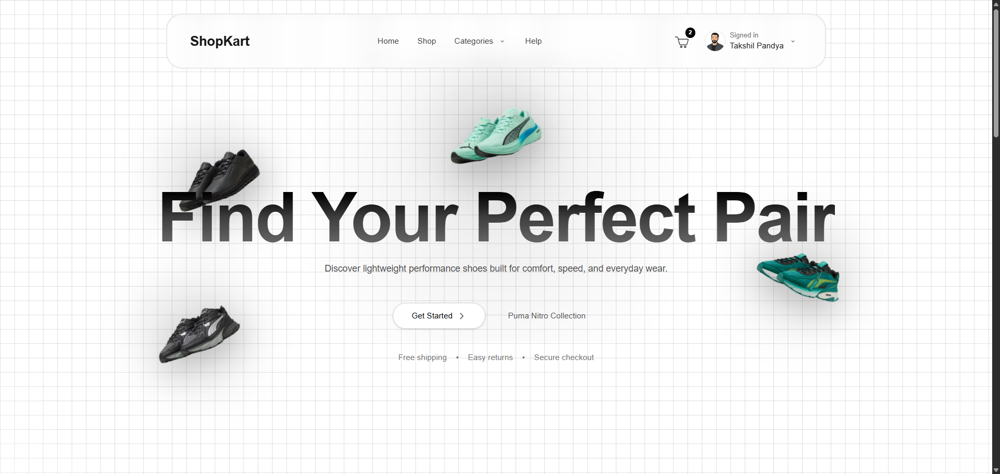
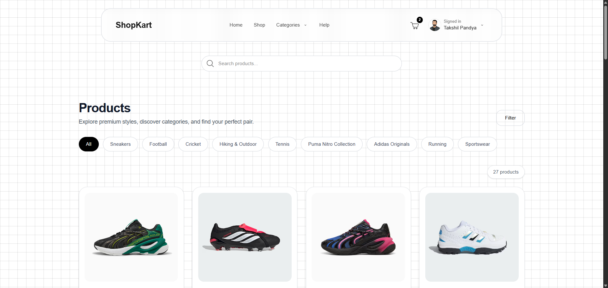
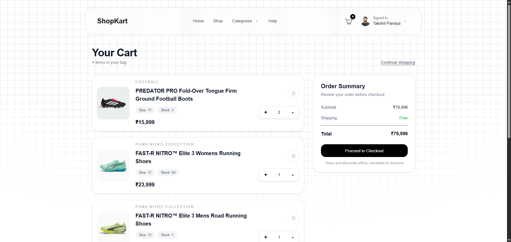
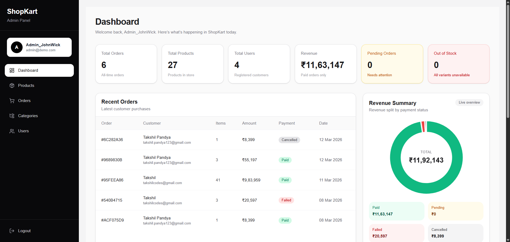
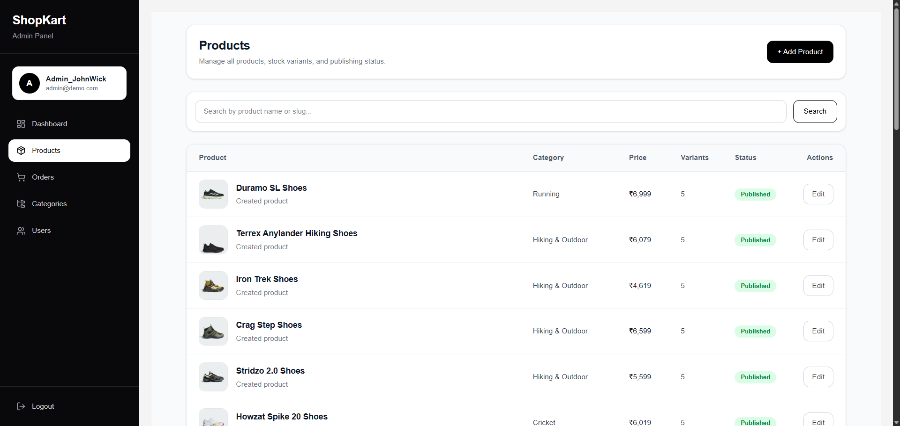
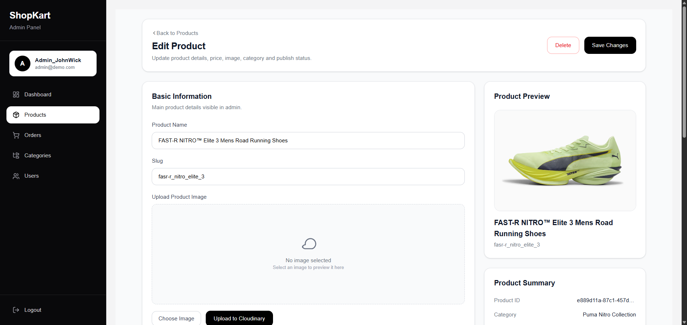

# 🛍️ ShopKart

A modern **full-stack e-commerce platform** built with **Next.js, TypeScript, Prisma, and PostgreSQL**.

ShopKart provides a complete online shopping experience including authentication, product browsing, cart management, checkout, and admin dashboard.

---

# 🚀 Live Demo

Website: https://shopkartsite.vercel.app

---

# ✨ Features

## 👤 User Features

- User signup & login
- Email verification with OTP
- Secure authentication (NextAuth + JWT)
- Browse products
- Category filtering
- Product search
- Pagination
- Add to cart
- Address management
- Checkout system
- Payment gateway integration
- Order creation and tracking

---

## 🛠 Admin Features

- Create / delete categories
- Add products
- Publish / unpublish products
- Manage users
- Delete users
- User search

Admin routes:

/admin  
/admin/products  
/admin/categories  
/admin/users  

---

# 🧰 Tech Stack

Frontend
- Next.js (App Router)
- React
- TypeScript
- Tailwind CSS
- Char.js

Backend
- Next.js API Routes
- Prisma ORM
- PostgreSQL (Neon)
- Redis (OTP storage)

Authentication
- NextAuth.js
- JWT sessions
- Email OTP verification

Payments
- Cashfree Payment Gateway

Deployment
- Vercel

---

## 📸 Screenshots

### Homepage

### Products Page

### Cart Page

### Admin Dashboard

### Admin Product Page

### Admin Edit Product

---

# ⚙️ Installation

Clone repository

git clone https://github.com/TakshilCodes/shopkart.git
cd shopkart

Install dependencies

npm install

---

# 🗄 Database Setup

Run migrations

npx prisma migrate dev

Generate Prisma client

npx prisma generate

Optional:

npx prisma studio

---

# ▶️ Run Development Server

npm run dev

Open http://localhost:3000

---

# 👨‍💻 Author

Takshil Pandya

GitHub: https://github.com/TakshilCodes  
LinkedIn: https://linkedin.com/in/takshilpandya  

